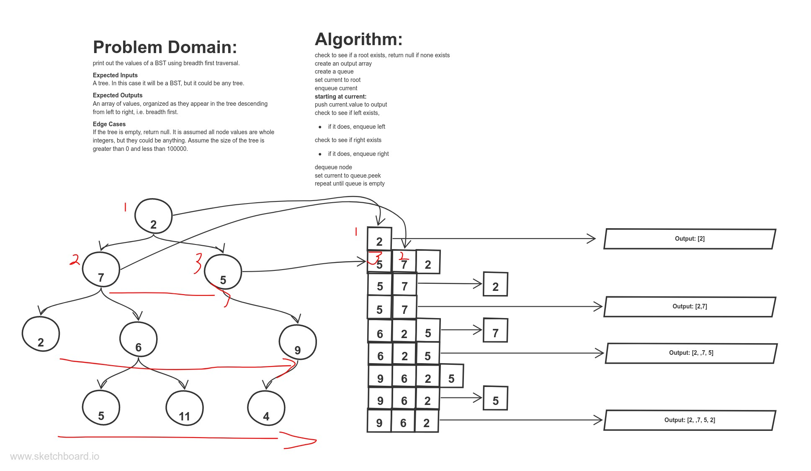

# Code Challenge 17 - Breadth First Traversal Of BST

## Challenge Summary
Given any tree, traverse the nodes breadth first and return the values in an array

## Approach & Efficiency
<!-- What approach did you take? Why? What is the Big O space/time for this approach? -->
This one is complicated to explain, but essentially you create a queue to store the values of each node's left and right.  You enqueue and dequeue the nodes of the tree while pushing the values to the output array in such a way that the values are returned top to bottom from left to right.  This requires O(n) space and time, as the queue will contain every node in the tree and we must visit every single node.

## Solution
