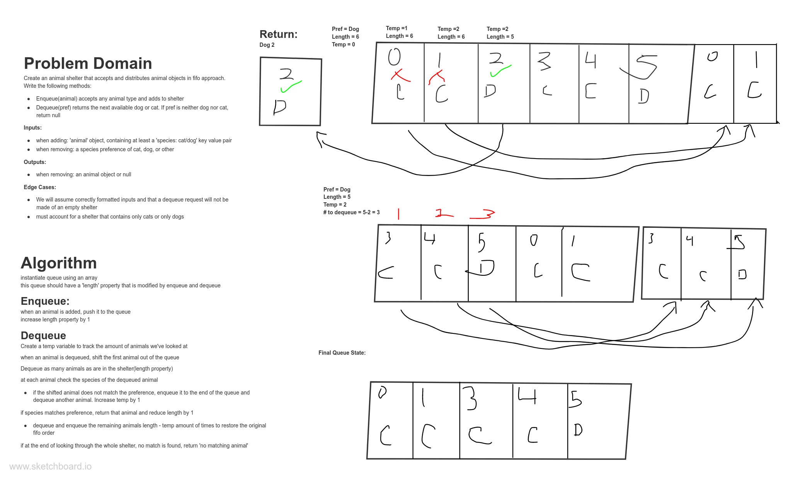

# Code Challenge 16 - Animal Shelter

## Challenge Summary
Create a class called AnimalShelter which holds only dogs and cats. The shelter operates using a first-in, first-out approach.
Implement the following methods:
enqueue(animal): adds animal to the shelter. animal can be either a dog or a cat object.
dequeue(pref): returns either a dog or a cat. If pref is not "dog" or "cat" then return null.
Practical application of array.splice. 

## Approach & Efficiency
<!-- What approach did you take? Why? What is the Big O space/time for this approach? -->
I used a queue (implemented with an array) to manage the FIFO order of the shelter.  Big O(N) for both space and time, as in the worst average case you will have to traverse the entire shelter to find a match;

## Solution
