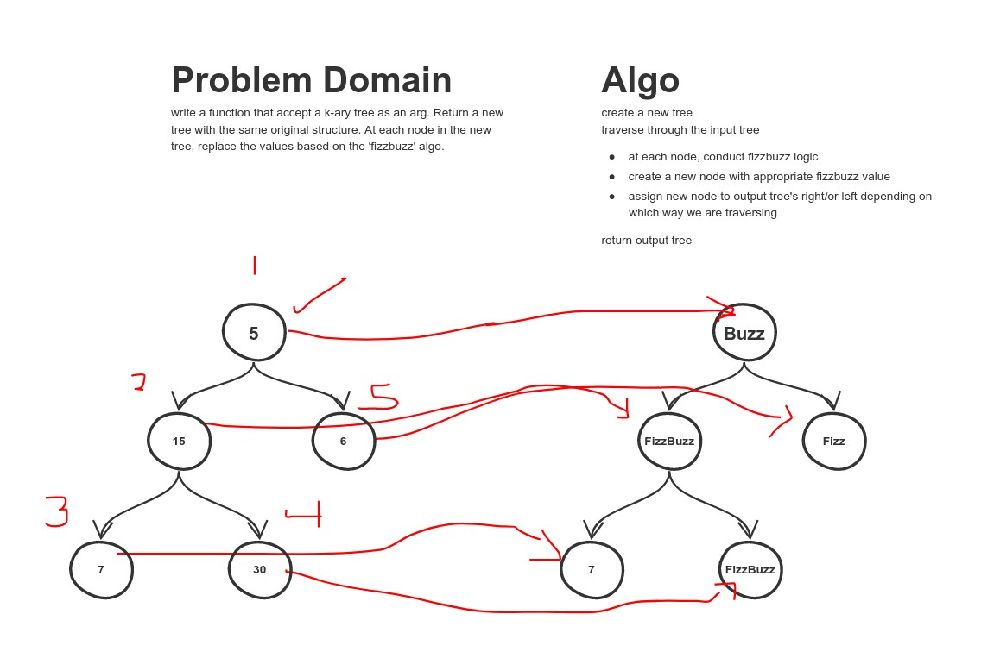

# Code Challenge 18 - FizzBuzz Tree

## Challenge Summary
Traverse a given k-ary tree and perform a fizzbuzz on each node.  Return a new tree with fizzbuzzed node values.

## Approach & Efficiency
<!-- What approach did you take? Why? What is the Big O space/time for this approach? -->
Did a simple preorder traversal.  At each node while traversing recursively also needed to pass in the output node for new tree into walk function.  Big O is O(n) for both time and efficiency as we'll have to traverse the entire tree.

## Solution
