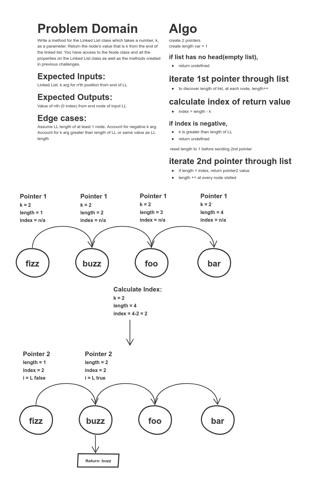

# Code Challenge 7 - k-th value from the end of a linked list.

## Challenge Summary
Write a method for the Linked List class which takes a number, k, as a parameter. Return the node’s value that is k from the end of the linked list. You have access to the Node class and all the properties on the Linked List class as well as the methods created in previous challenges.

## Approach & Efficiency
<!-- What approach did you take? Why? What is the Big O space/time for this approach? -->
Used 2 pointers.  First pointer returns the length of the List, the second pointer uses that to calculate kth distance and iterate to the correct node.  Since we are not creating a new list and just iterating through input list, O(n) for both time and space.

## Solution
