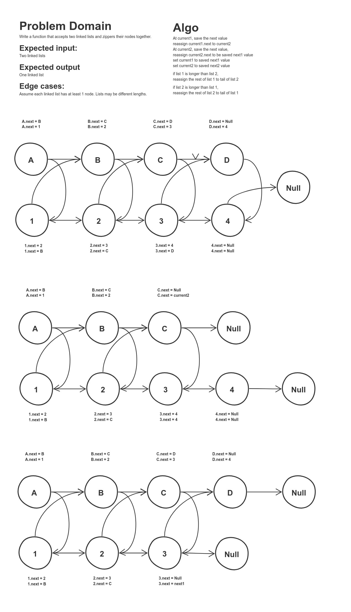

# Code Challenge 8 - LinkedList Zipper

## Challenge Summary
Write a function called zipLists which takes two linked lists as arguments. Zip the two linked lists together into one so that the nodes alternate between the two lists and return a reference to the head of the zipped list. Try and keep additional space down to O(1). You have access to the Node class and all the properties on the Linked List class as well as the methods created in previous challenges.

## Approach & Efficiency
<!-- What approach did you take? Why? What is the Big O space/time for this approach? -->
I traversed each list in place and reassigned next values to avoid having to return a new list.  This minimizes space requirements and returns a space of O(1) and time of O(n);

## Solution
