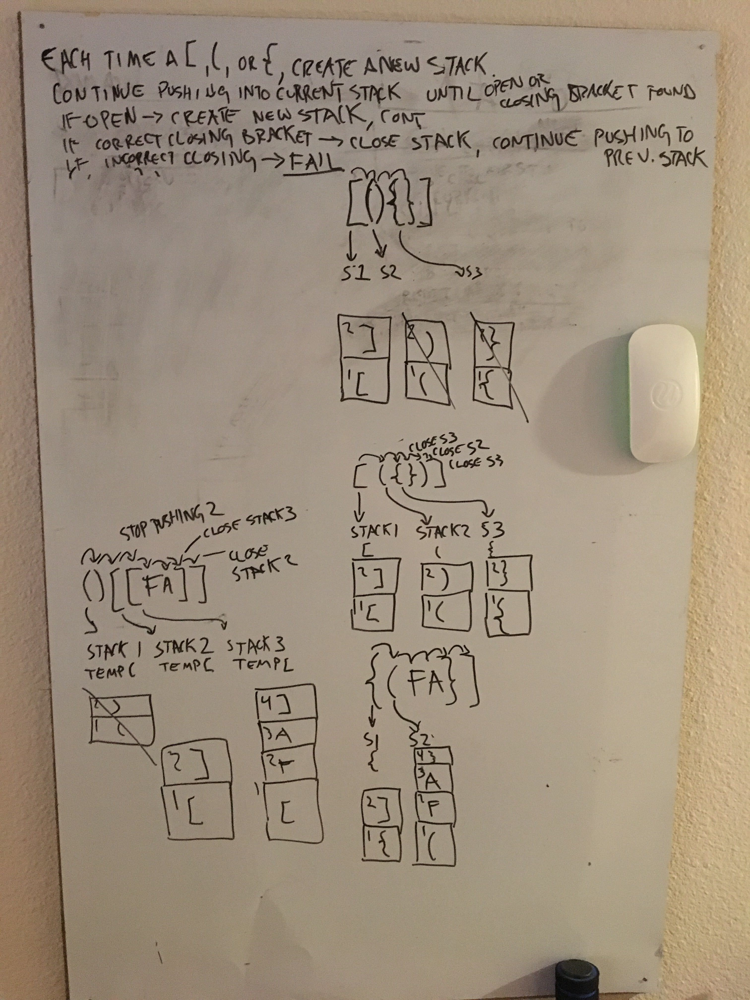

# Code Challenge 13 - MultiBracket Validation

## Challenge Summary
Your function should take a string as its only argument, and should return a boolean representing whether or not the brackets in the string are balanced. There are 3 types of brackets:

Round Brackets : ()
Square Brackets : []
Curly Brackets : {}

## Approach & Efficiency
<!-- What approach did you take? Why? What is the Big O space/time for this approach? -->
I (attempted) to implement a stack that splits the input string, regexes out anything that isn't a bracket, and then pushes opening brackets into the stack and peeks to make sure each closing bracket added matches.  Still need to fix implementation.  My whiteboard attempted this same logic but with multiple stacks, which was a nightmare.

## Solution
