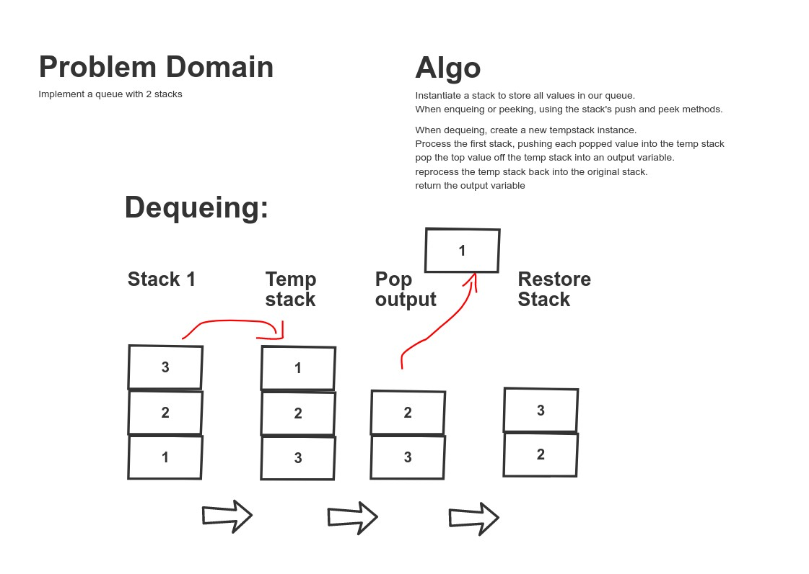

# Code Challenge 11 - Queue with Stacks

## Challenge Summary
Implement a queue with two stacks
## Approach & Efficiency
<!-- What approach did you take? Why? What is the Big O space/time for this approach? -->
used 2 stacks to implement a queue

## Solution
