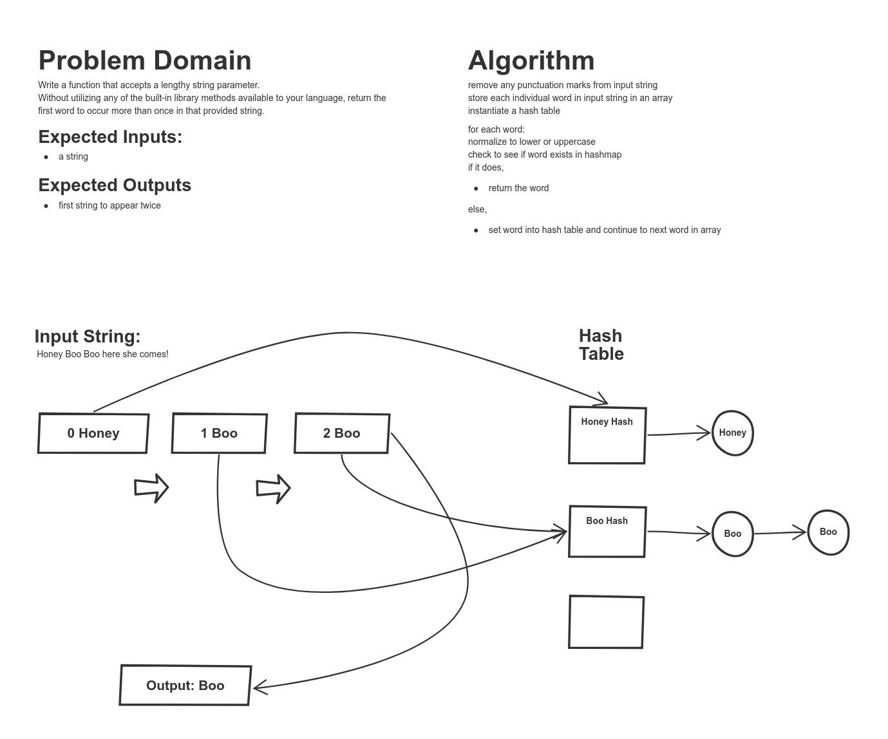

# Code Challenge 31 - FizzBuzz Tree

## Challenge Summary
Find the first repeated word in an input string
## Approach & Efficiency
<!-- What approach did you take? Why? What is the Big O space/time for this approach? -->
Sliced the input string and stored each word in a hashmap.  0(N) for both space and time.

## Solution
