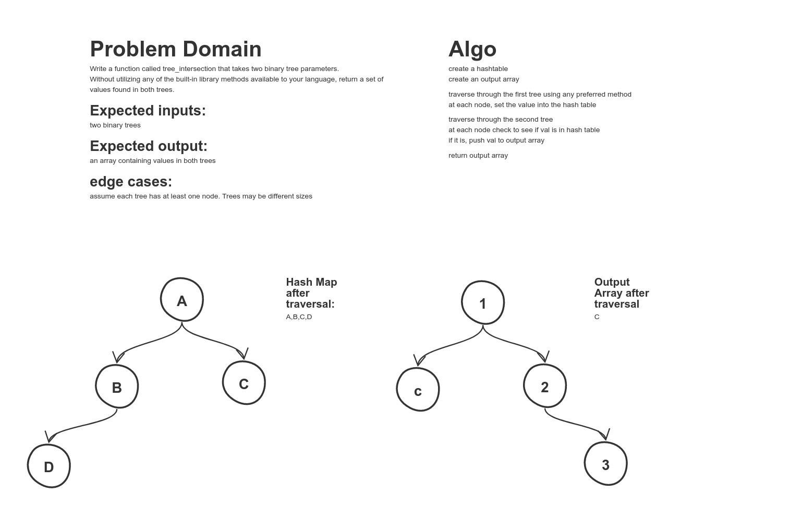

# Code Challenge 32 - Tree Intersection

## Challenge Summary
Write a function called tree_intersection that takes two binary tree parameters.
Without utilizing any of the built-in library methods available to your language, return a set of values found in both trees.

## Approach & Efficiency
I used a hashtable to quickly and efficiently store all the values of tree1 and quickly check them against tree2.  Time is o(n) since we have to visit every nod ein both tree, and space is o(n) as we have to store at least every value in tree1.
## Solution
